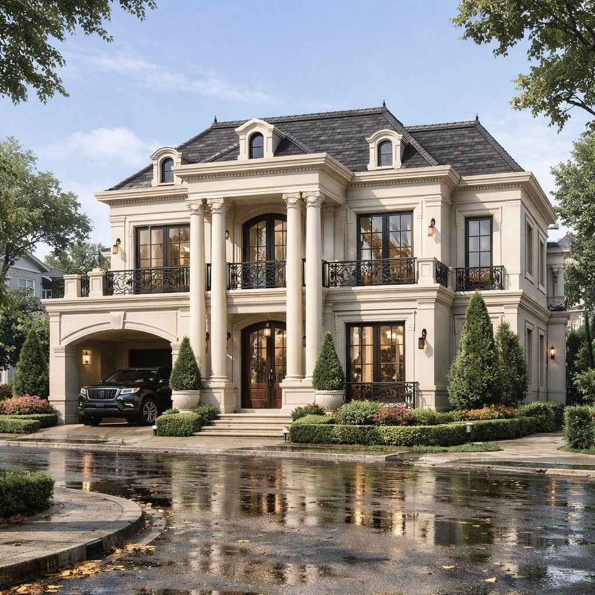
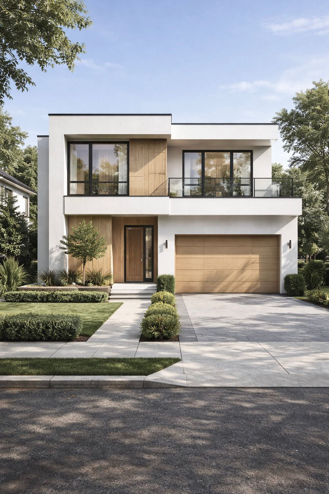
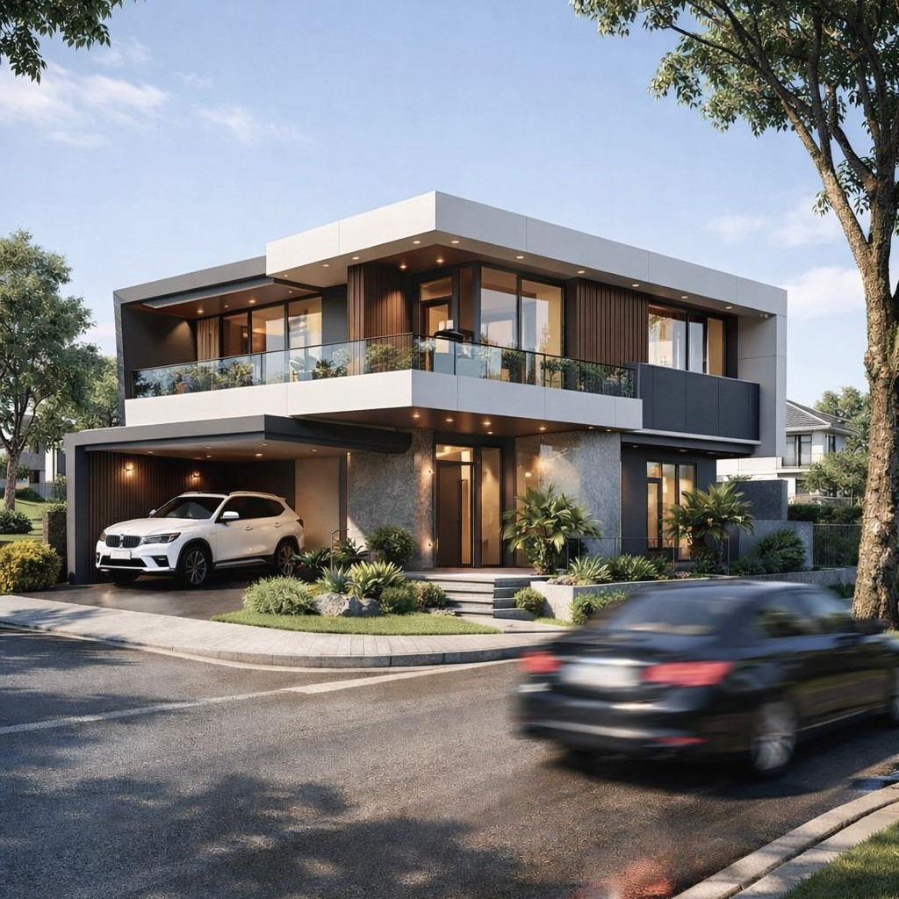
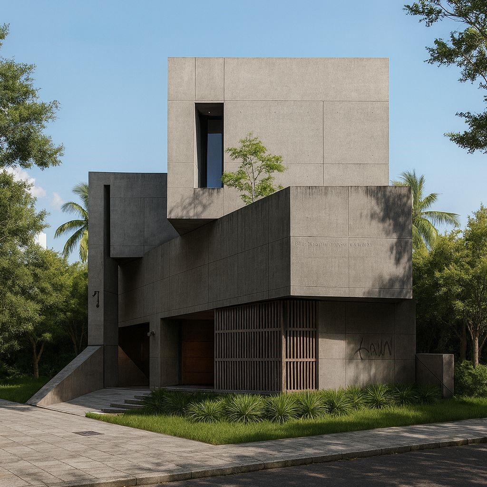
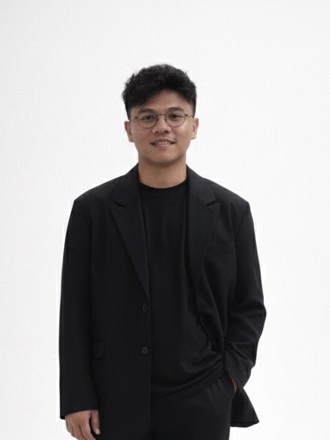

<html lang="id">
<head>
  <meta charset="UTF-8" />
  <meta name="viewport" content="width=device-width, initial-scale=1.0" />
  <title>Rataatap Studio</title>
  <link rel="preconnect" href="https://fonts.googleapis.com">
  <link rel="preconnect" href="https://fonts.gstatic.com" crossorigin>
  <link href="https://fonts.googleapis.com/css2?family=Inter:wght@300;400;500;600;700&display=swap" rel="stylesheet">
  
</head>
<body>

  <!-- NAVBAR -->
  <header>
    

      
RATAATAP STUDIO

      <nav class="menu">
        <a href="#projects">Projects</a>
        <a href="#about">About</a>
        <a href="#contact">Contact</a>
      </nav>
    

  </header>

  <!-- HERO -->
  

    

      <h1>Architecture & Interior Design Studio</h1>
      
Studio desain arsitektur dan interior dengan pendekatan modern, simpel, dan fungsional.

    

  

  <!-- PROJECTS -->
<section id="projects">
  
Popular Design

  

    

      
    

    

      
    

    

      
    

    

      
    

    

      
    

    

      
    

  

</section>

  <!-- ABOUT -->
  <section id="about">
    
About Us

    

      

        Rataatap Studio adalah jasa desain arsitektur dan interior yang berfokus pada visual yang bersih,
        modern, dan kontekstual. Kami menangani desain gambar, konsep, hingga visualisasi 3D.
      

      

        Didirikan pada 11 November 2025, Rataatap bertujuan menghadirkan desain yang efisien,
        realistis, dan siap diwujudkan.
      

    

    <!-- TOGGLE TEAM -->
    

      <button id="teamToggle" style="background:none;border:1px solid #262626;color:#e5e7eb;padding:14px 28px;cursor:pointer;font-size:14px;">
        Lihat Tim Kami
      </button>
    

    <!-- TEAM SECTION (HIDDEN) -->
    

      
Our Team

      

        

          

            
            
Head Office

          

        

        

          

            
            
Desainer Arsitektural

          

        

        

          

            
            
Civil Engineering

          

        

        

          

            
            
Desainer Interior

          

        

        

          

            
            
Konten Creator

          

        

      

    

  </section>

  <!-- MODAL -->
  

    

      
      <h3 id="modalTitle"></h3>
      

      
Tutup

    

  

  <!-- CONTACT -->
  <!-- SERVICES -->
  <section id="services">
    
Harga & Layanan

    

      

        
Jasa Desain Rumah

      

      

        
Jasa Desain Villa Arsitektural

      

      

        
Jasa Desain Interior

      

      

        
Jasa Bangunan Lainnya

      

      

        
Jasa Desain Renovasi Rumah

      

    

  </section>

  <!-- SERVICE MODAL -->
  

    

      <h3 id="serviceTitle"></h3>
      
      <a id="downloadBtn" href="#" download style="display:inline-block;margin-top:10px;border:1px solid #262626;padding:12px 24px;font-size:13px;">Download Poster</a>
      
Tutup

    

  

<section id="contact">
  
Connect With Us

  

    <!-- WhatsApp -->
    <a href="https://wa.me/6281234567890" target="_blank" aria-label="WhatsApp">
      <i class="fab fa-whatsapp"></i>
    </a>

    <!-- Instagram -->
    <a href="https://www.instagram.com/rataatapstudio" target="_blank" aria-label="Instagram">
      <i class="fab fa-instagram"></i>
    </a>

    <!-- TikTok -->
    <a href="https://www.tiktok.com/@rataatapstudio" target="_blank" aria-label="TikTok">
      <i class="fab fa-tiktok"></i>
    </a>

    <!-- YouTube -->
    <a href="https://www.youtube.com/@rataatapstudio" target="_blank" aria-label="YouTube">
      <i class="fab fa-youtube"></i>
    </a>
  

</section>

<link rel="stylesheet" href="https://cdnjs.cloudflare.com/ajax/libs/font-awesome/6.5.1/css/all.min.css">

  <!-- FOOTER -->
  <footer>
    © 2025 Rataatap Studio. All rights reserved.
  </footer>

  

</body>
</html>

